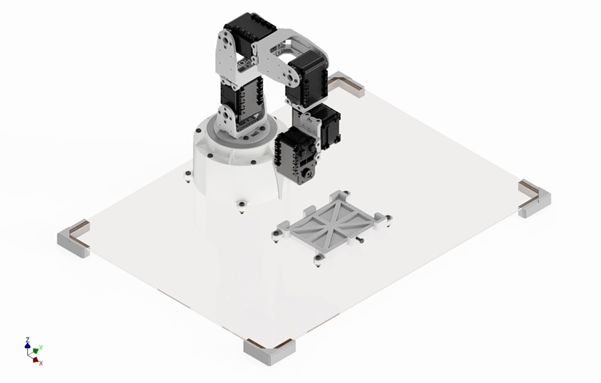
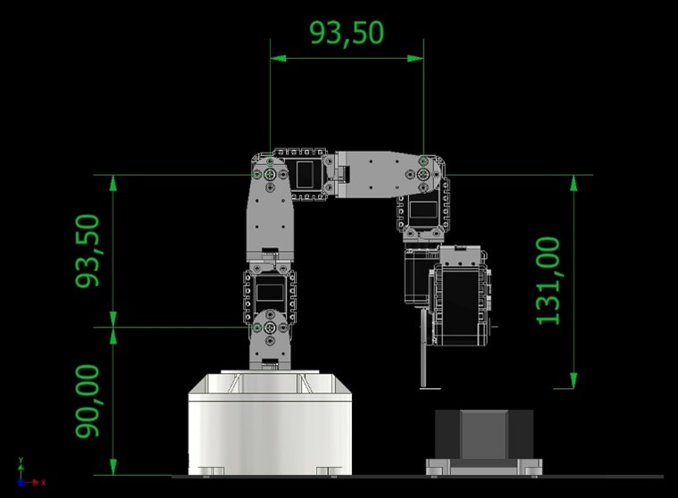
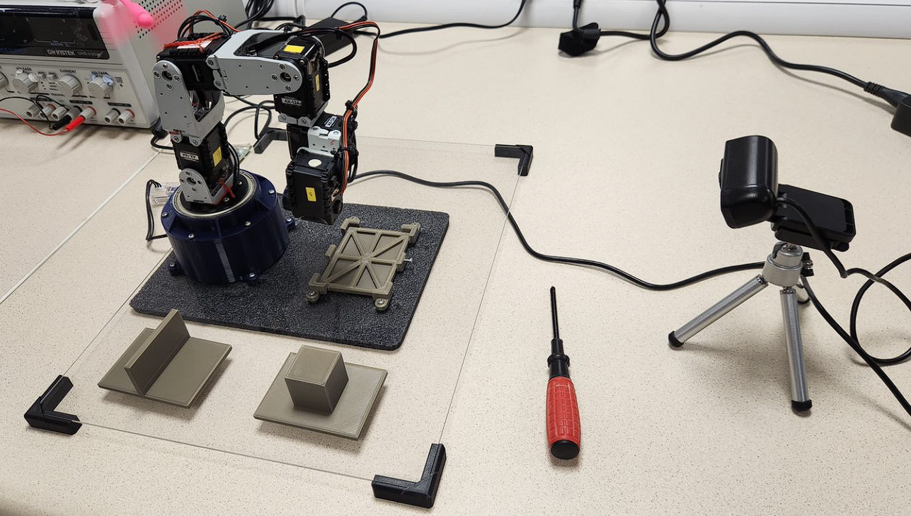

# 5-DOF-Robotic-Manipulator
3D printed 5-DOF manipulator simulating welding tasks.

A 3D printed 5-DOF robotic manipulator was controlled using Dynamixel servo motors to simulate welding tasks. Inverse kinematics algorithms were created to control the joint angles given target coordinates in the task space.

  
   

  
   

  
   

